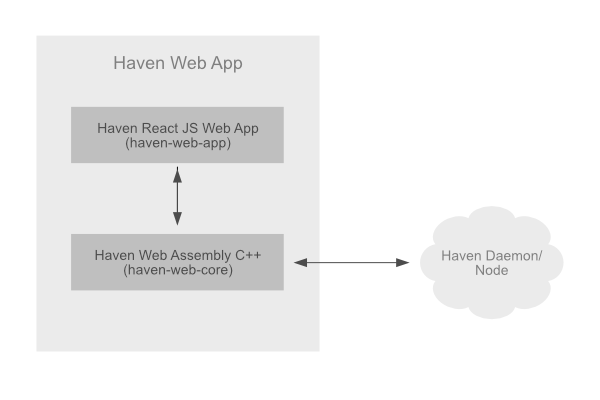

## Haven Protocol Web App
This is a guide to help developers wanting to work with the Haven Protocol web eco-system to get started on new developments.

The web ecosystem spans a few different git repos;

- [haven-web-app](https://github.com/haven-protocol-org/haven-web-app) the ReactJS code

- [haven-web-core](https://github.com/haven-protocol-org/haven-web-core) exposes compiled WebAssembly to JS 

- [haven-web-cpp](https://github.com/haven-protocol-org/haven-web-cpp) a C++ wrapper to create a reusable API from the core C++ library

- [haven-main](https://github.com/haven-protocol-org/haven-main) the core Haven C++ library

Haven is a fork of [Monero](https://www.getmonero.org/) a best of breed privacy coin with the mint and burn of assets that track fiat and other currencies, allowing storage of assets without exposure to the volitality of cryptocurrenciey markets.
Currently Haven is build ontop of the Monero v0.16.

---
> [Getting Started :arrow_right:](getting-started.md)
---

Please send pull requests for changes as you find they're needed.

