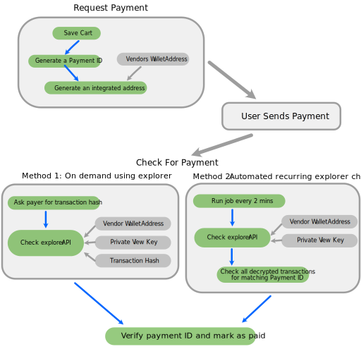

## Haven Protocol
# Payment Gateway Integration

### Overview
This is a brief guide for integrating Haven as a payment provider for online payments.


First register the payment with your 3rd party shopping cart system. To be able to identify the incoimming payment you need to generate a payment ID, then use the payment ID and payment address to generate an [**integrated address**](https://havenprotocol.org/knowledge/payment-ids/), this is an encoded address that contains the payment id and the payment address.
Ask the user to pay the amount to the integrated address.
Next you can use the Haven block explorer to check if the payment has been made.   
**Option 1:** Doesn't require an automated job to be setup but does add a buden to the user to supply the transaction hash/ID. After they have paid they enter the transaction hash allowing the vendor to identify the transaction.   
**Option 2:** Requires an automated job running constantly in the background that checks the explorer for any new payments into the address using the payment wallet's private view key. It would need to run at minimum every 10 mins, as the api check the last 5 blocks and each block is a 2 minute time frame  
**Option 3:** Use a direct integration with the Haven wallet RPC daemon, this requires running a Haven daemon on your server, this solution is outside of this documents remit, more information is available at [docs.havenprotocol.](https://docs.havenprotocol.org/rpc/1.2.9q/RPC_API.html) and there are PHP code examples in the [Haven payment gateway](https://github.com/blueyred/haven-payment-gateway/) repository




## Haven Explorer API
Some usage information for the API is available at the [explorer readme](https://github.com/haven-protocol-org/haven-explorer)  

### For an automated check results
```
/api/outputsblocks?address={VENDOR_WALLET_ADDRESS}&viewkey={PRIVATE_VIEWKEY}&limit=5&mempool=1
```

###  Supplying the transaction hash
```
/api/outputs?txhash={TX_HASH}&address={VENDOR_WALLET_ADDRESS}&viewkey={PRIVATE_VIEWKEY}&txprove=0
```

## PHP Example
A full PHP example of integrating with WooCommerce is available at the
[Haven payment gateway](https://github.com/blueyred/haven-payment-gateway/) repository

---
   
      

## FAQs
### What is the Explorer?
The explorer is a way to view the data in the Haven blockchain.   
mainnet: https://explorer.havenprotocol.org/   
testnet: https://explorer-testnet.havenprotocol.org/
They have a web facing set of pages which are useable in a browser and a set of api endpoints that can be queried and return json.

### What is an integrated address?
An integrated address is just your normal address with payment ID bundled with it. While the resulting address looks different, the purpose is not to hide your actual address, but to pack it and the payment ID together to avoid errors and to communicate it easily.

### What is a transaction hash?
Within each block of the blockchain there are multiple transactions. Each transaction has an identifier hash, refered to as the **tx id** or **tx hash** and looks something like:  <font size="1">140564273396a16135ba0867ded6b7981fdc28bda45c62f993dc51ff26cfb2e5 a32087d20f25e45097da9c899d8ec17df1d7563abe19047b3d115fe894bbf383</font>


### What is a testnet?  
testnet is a development environment that is functionally equivalent to the live blockchain (mainnet), you should use testnet when developing new features, making sure there is no risk to real funds or the main chain.


---
[FAQ]({{ site.baseurl }}){: .btn .btn-primary .fs-5 .mb-4 .mb-md-0 .mr-2 }

---
